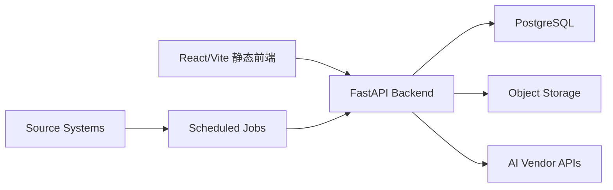

# 数据与 AI 代理架构

## 当前基线

当前系统是静态 React/Vite 应用，通过 nginx 托管在腾讯云轻量服务器。页面数据主要来自前端静态 TypeScript 文件，数据来源治理集中在 `app/src/data/source-registry.ts`。AI 设计助手当前保留本地演示模式，真实图像生成必须走服务端代理。

## 目标架构

下一阶段采用“静态前端 + 后端 API + 数据库 + 对象存储 + 任务执行”的最小架构。前端继续由 nginx 托管，后端负责数据复核、真实数据导入、报告生成和 AI 供应商代理。

## 服务边界

| 模块 | 职责 | 不承担 |
|---|---|---|
| 静态前端 | 展示看板、提交筛选条件、发起生成请求、展示复核状态 | 保存供应商密钥、直接调用外部 AI 或平台 API |
| Backend API | 鉴权、数据查询、复核状态维护、报告任务、AI 代理 | 存放前端构建产物 |
| PostgreSQL | 结构化业务数据、来源 registry、复核日志、生成请求元数据 | 存放大图片文件 |
| Object Storage | AI 生成图、报告导出、原始导入文件 | 充当业务数据库 |
| Scheduled Jobs | 外部数据导入、快照生成、质量检查 | 直接修改前端源码 |

## 数据流

1. 外部或内部数据先进入 staging 表或对象存储原始区。
2. 任务执行层完成字段校验、去重、脱敏和口径标准化。
3. 通过 source registry 绑定来源、复核状态、时间窗口和 owner。
4. 后端 API 只向前端返回可展示字段和复核状态。
5. 报告生成使用固定数据快照，不直接读取临时导入文件。

## 核心数据表

| 表 | 用途 | 关键字段 |
|---|---|---|
| `source_registry` | 数据来源主表 | `id`、`module`、`metric`、`source_name`、`verification_status`、`last_verified` |
| `source_review_log` | 来源复核留痕 | `source_id`、`reviewer`、`status_before`、`status_after`、`review_note` |
| `data_snapshot` | 数据快照 | `snapshot_id`、`source_id`、`period`、`checksum`、`created_at` |
| `report_job` | 报告生成任务 | `job_id`、`template_id`、`snapshot_ids`、`status`、`output_url` |
| `ai_generation_request` | AI 生成请求 | `request_id`、`model`、`prompt_hash`、`status`、`owner` |
| `ai_generation_asset` | AI 生成资产 | `asset_id`、`request_id`、`object_key`、`license_status`、`created_at` |

## API 草案

| Endpoint | 方法 | 用途 |
|---|---|---|
| `/api/sources` | `GET` | 查询来源 registry |
| `/api/sources/:id/reviews` | `POST` | 写入来源复核记录 |
| `/api/snapshots` | `GET` | 查询可用数据快照 |
| `/api/reports/jobs` | `POST` | 创建报告生成任务 |
| `/api/reports/jobs/:id` | `GET` | 查询报告生成状态 |
| `/api/ai/images/generations` | `POST` | 创建 AI 图像生成任务 |
| `/api/ai/images/generations/:id` | `GET` | 查询 AI 图像生成结果 |

所有写接口必须有操作者身份、审计日志和请求幂等键。

## AI image proxy 最小架构

### 请求路径

1. 前端提交模型、prompt、比例、分辨率、参考图 asset id 和业务用途。
2. Backend API 校验权限、配额、敏感词和用途。
3. Backend API 从服务端环境变量读取供应商密钥。
4. Backend API 调用 Kimi、OpenAI、Stability AI 或合规第三方服务。
5. 生成结果写入对象存储，并记录 `ai_generation_request` 与 `ai_generation_asset`。
6. 前端只读取代理返回的资产 URL 和生成状态。

### 安全规则

| 规则 | 实施方式 |
|---|---|
| 供应商密钥不进浏览器 | 只存服务端环境变量，不返回给前端 |
| 请求可追溯 | 每次生成写入 request id、owner、模型、时间和参数摘要 |
| 资产可治理 | 每张图片绑定用途、来源模型、license 状态和删除状态 |
| 成本可控 | 按用户、模型和天设置配额 |
| 内容可审查 | prompt 和输出资产进入审核队列 |

## 部署形态

腾讯云轻量服务器上保留 nginx 静态托管。当前存在两个与本项目相关的静态入口：宿主 landing page 和 mkt53 看板本体。新增后端后，nginx 增加 `/api/` 反向代理到后端容器。

| 当前入口 | nginx root | 宿主路径 | 说明 |
|---|---|---|---|
| `https://lute-tlz-dddd.top` | `/var/www/landing` | `/opt/ai-video/deploy/lighthouse/landing/index.html` | 宿主导航页，多服务卡片网格，其中 `card mkt` 进入本项目 |
| `https://mkt.lute-tlz-dddd.top` | `/var/www/mkt53` | `/opt/mkt53/html/` | mkt53 Vite 静态看板 |

两者共享 `ai_video_nginx` 容器，但发布路径不同。`npm run deploy:prod` 只同步 `/opt/mkt53/html/`；宿主 landing 卡片需要单独备份并替换 `index.html`。

| 组件 | 推荐实现 |
|---|---|
| Backend API | Python 3.12 + FastAPI |
| Database | PostgreSQL |
| ORM | SQLAlchemy 2.0 |
| Validation | Pydantic V2 |
| Jobs | 先用 cron 或轻量 worker，复杂编排再引入 Temporal |
| Object Storage | 腾讯云 COS 或兼容 S3 的对象存储 |
| Secrets | 服务端环境变量或云厂商密钥管理 |

## 最小上线顺序

| 顺序 | 交付物 | Owner | 数据依赖 | 验收指标 |
|---|---|---|---|---|
| 1 | Backend API 骨架与健康检查 | 工程组 | nginx `/api/` 路由、运行环境变量 | `/api/health` 返回版本、环境和启动时间 |
| 2 | source registry 数据表迁移 | 数据工程组 | 当前 `source-registry.ts` | 现有来源条目 100% 可从 API 查询 |
| 3 | 来源复核写接口 | 数据工程组 | `source_review_log`、操作者身份 | 每次状态变更有审计记录 |
| 4 | 数据快照接口 | 数据工程组 | P0 数据域快照 | 前端页面可展示快照时间和 source id |
| 5 | AI image proxy | AI 组 | 供应商 API、对象存储、生成参数 | 浏览器 bundle 不含供应商密钥，生成资产有审计记录 |
| 6 | 报告生成任务 | 市场分析组 | 报告模板、数据快照、图表配置 | 生成报告能追溯到 snapshot id 和 source id |

## 不做项

1. 不在浏览器保存供应商 API key。
2. 不让静态前端直接调用供应商 AI、Amazon、CRM 或海关接口。
3. 不把未核实法规显示为已验证事实。
4. 不把对象存储当作数据复核状态库。
5. 不让报告生成绕过 source registry 和数据快照。
